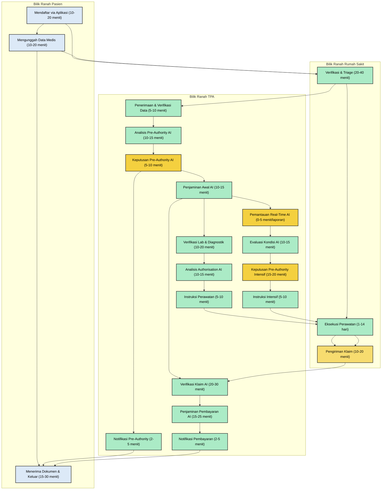

```mermaid
graph TD
    subgraph Bilik Ranah Pasien
        A["Mendaftar via Aplikasi (10-20 menit)"] --> B["Mengunggah Data Medis (10-20 menit)"]
        B --> C["Menerima Dokumen & Keluar (15-30 menit)"]
        style A fill:#DCE9F7,stroke:#333,stroke-width:2px,color:#000
        style B fill:#DCE9F7,stroke:#333,stroke-width:2px,color:#000
        style C fill:#DCE9F7,stroke:#333,stroke-width:2px,color:#000
    end

    subgraph Bilik Ranah Rumah Sakit
        D["Verifikasi & Triage (20-40 menit)"] --> E["Eksekusi Perawatan (1-14 hari)"]
        E --> F["Pengiriman Klaim (10-20 menit)"]
        style D fill:#ABEBC6,stroke:#333,stroke-width:2px,color:#000
        style E fill:#ABEBC6,stroke:#333,stroke-width:2px,color:#000
        style F fill:#F7DC6F,stroke:#333,stroke-width:2px,color:#000
    end

    subgraph Bilik Ranah TPA
        G["Penerimaan & Verifikasi Data (5-10 menit)"] --> H["Analisis Pre-Authority AI (10-15 menit)"]
        H --> I["Keputusan Pre-Authority AI (5-10 menit)"] --> J["Notifikasi Pre-Authority (2-5 menit)"]
        I --> K["Penjaminan Awal AI (10-15 menit)"]
        K --> L["Verifikasi Lab & Diagnostik (10-20 menit)"] --> M["Analisis Authorisation AI (10-15 menit)"]
        M --> N["Instruksi Perawatan (5-10 menit)"]
        K --> O["Pemantauan Real-Time AI (0-5 menit/laporan)"] --> P["Evaluasi Kondisi AI (10-15 menit)"]
        P --> Q["Keputusan Pre-Authority Intensif (15-20 menit)"] --> R["Instruksi Intensif (5-10 menit)"]
        K --> S["Verifikasi Klaim AI (20-30 menit)"] --> T["Penjaminan Pembayaran AI (15-25 menit)"] --> U["Notifikasi Pembayaran (2-5 menit)"]
        style G fill:#ABEBC6,stroke:#333,stroke-width:2px,color:#000
        style H fill:#ABEBC6,stroke:#333,stroke-width:2px,color:#000
        style I fill:#F4D03F,stroke:#333,stroke-width:2px,color:#000
        style J fill:#ABEBC6,stroke:#333,stroke-width:2px,color:#000
        style K fill:#ABEBC6,stroke:#333,stroke-width:2px,color:#000
        style L fill:#ABEBC6,stroke:#333,stroke-width:2px,color:#000
        style M fill:#ABEBC6,stroke:#333,stroke-width:2px,color:#000
        style N fill:#ABEBC6,stroke:#333,stroke-width:2px,color:#000
        style O fill:#F4D03F,stroke:#333,stroke-width:2px,color:#000
        style P fill:#ABEBC6,stroke:#333,stroke-width:2px,color:#000
        style Q fill:#F4D03F,stroke:#333,stroke-width:2px,color:#000
        style R fill:#ABEBC6,stroke:#333,stroke-width:2px,color:#000
        style S fill:#ABEBC6,stroke:#333,stroke-width:2px,color:#000
        style T fill:#ABEBC6,stroke:#333,stroke-width:2px,color:#000
        style U fill:#ABEBC6,stroke:#333,stroke-width:2px,color:#000
    end

    A --> D
    B --> D
    D --> G
    E --> F
    F --> S
    J --> C
    N --> E
    R --> E
    U --> C
```
