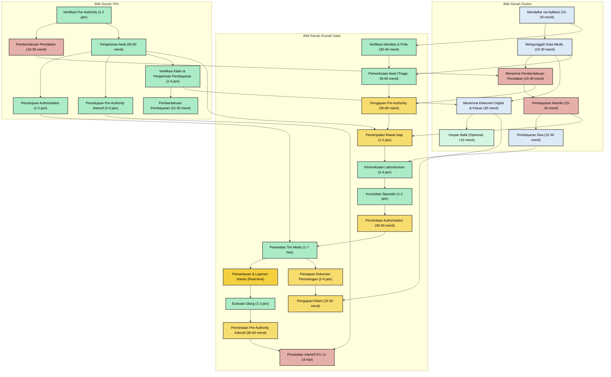

```mermaid
graph TD
subgraph Bilik Ranah Pasien
A["Mendaftar via Aplikasi (15-30 menit)"] --> B["Mengunggah Data Medis (15-30 menit)"]
B --> C["Menerima Pemberitahuan Penolakan (15-30 menit)"] --> D["Pembayaran Mandiri (15-30 menit)"] --> E["Pembayaran Sisa (15-30 menit)"]
B --> F["Menerima Dokumen Digital & Keluar (30 menit)"] --> G["Umpan Balik (Opsional, <15 menit)"]
style A fill:#DCE9F7,stroke:#333,stroke-width:2px,color:#000
style B fill:#DCE9F7,stroke:#333,stroke-width:2px,color:#000
style C fill:#E6B0AA,stroke:#333,stroke-width:2px,color:#000
style D fill:#E6B0AA,stroke:#333,stroke-width:2px,color:#000
style E fill:#DCE9F7,stroke:#333,stroke-width:2px,color:#000
style F fill:#DCE9F7,stroke:#333,stroke-width:2px,color:#000
style G fill:#D5F5E3,stroke:#333,stroke-width:2px,color:#000
end

    subgraph Bilik Ranah Rumah Sakit
        H["Verifikasi Identitas & Polis (30-45 menit)"] --> I["Pemeriksaan Awal (Triage, 30-60 menit)"]
        I --> J["Pengajuan Pre-Authority (30-60 menit)"] --> K["Penempatan Rawat Inap (1-2 jam)"]
        K --> L["Pemeriksaan Laboratorium (2-4 jam)"] --> M["Konsultasi Spesialis (1-2 jam)"]
        M --> N["Permintaan Authorisation (30-60 menit)"] --> O["Perawatan Tim Medis (1-7 hari)"]
        O --> P["Pemantauan & Laporan Harian (Real-time)"]
        P --> Q["Evaluasi Ulang (1-2 jam)"] --> R["Permintaan Pre-Authority Intensif (30-60 menit)"] --> S["Perawatan Intensif ICU (1-14 hari)"]
        O --> T["Persiapan Dokumen Pemulangan (2-4 jam)"] --> U["Pengajuan Klaim (15-30 menit)"]
        style H fill:#ABEBC6,stroke:#333,stroke-width:2px,color:#000
        style I fill:#ABEBC6,stroke:#333,stroke-width:2px,color:#000
        style J fill:#F7DC6F,stroke:#333,stroke-width:2px,color:#000
        style K fill:#F7DC6F,stroke:#333,stroke-width:2px,color:#000
        style L fill:#ABEBC6,stroke:#333,stroke-width:2px,color:#000
        style M fill:#ABEBC6,stroke:#333,stroke-width:2px,color:#000
        style N fill:#F7DC6F,stroke:#333,stroke-width:2px,color:#000
        style O fill:#ABEBC6,stroke:#333,stroke-width:2px,color:#000
        style P fill:#F4D03F,stroke:#333,stroke-width:2px,color:#000
        style Q fill:#ABEBC6,stroke:#333,stroke-width:2px,color:#000
        style R fill:#F7DC6F,stroke:#333,stroke-width:2px,color:#000
        style S fill:#E6B0AA,stroke:#333,stroke-width:2px,color:#000
        style T fill:#F7DC6F,stroke:#333,stroke-width:2px,color:#000
        style U fill:#F7DC6F,stroke:#333,stroke-width:2px,color:#000
    end

    subgraph Bilik Ranah TPA
        V["Verifikasi Pre-Authority (1-2 jam)"] --> W["Pemberitahuan Penolakan (15-30 menit)"]
        V --> X["Penjaminan Awal (30-60 menit)"]
        X --> Y["Persetujuan Authorisation (1-2 jam)"]
        X --> Z["Persetujuan Pre-Authority Intensif (2-4 jam)"]
        X --> AA["Verifikasi Klaim & Penjaminan Pembayaran (2-4 jam)"] --> AB["Pemberitahuan Pembayaran (15-30 menit)"]
        style V fill:#ABEBC6,stroke:#333,stroke-width:2px,color:#000
        style W fill:#E6B0AA,stroke:#333,stroke-width:2px,color:#000
        style X fill:#ABEBC6,stroke:#333,stroke-width:2px,color:#000
        style Y fill:#ABEBC6,stroke:#333,stroke-width:2px,color:#000
        style Z fill:#ABEBC6,stroke:#333,stroke-width:2px,color:#000
        style AA fill:#ABEBC6,stroke:#333,stroke-width:2px,color:#000
        style AB fill:#ABEBC6,stroke:#333,stroke-width:2px,color:#000
    end

    A --> H
    B --> I
    C --> J
    D --> K
    E --> L
    F --> U
    W --> C
    X --> K
    Y --> O
    Z --> S
    AA --> F
```
