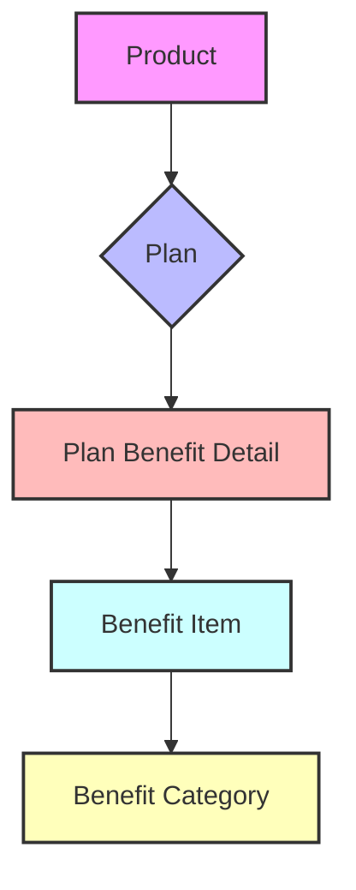

```mermaid
graph TD
    A[Product] --> B{Plan};
    B --> C[Plan Benefit Detail];
    C --> D[Benefit Item];
    D --> E[Benefit Category];

    style A fill:#f9f,stroke:#333,stroke-width:2px
    style B fill:#bbf,stroke:#333,stroke-width:2px
    style C fill:#fbb,stroke:#333,stroke-width:2px
    style D fill:#cff,stroke:#333,stroke-width:2px
    style E fill:#ffb,stroke:#333,stroke-width:2px
```
