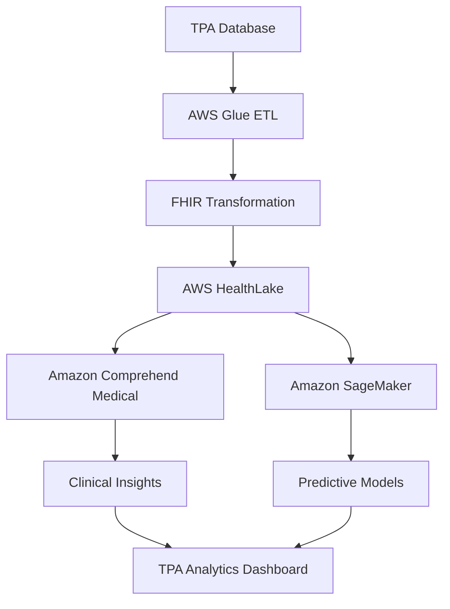

# AWS HealthLake Integration Plan for TPA Healthcare AI System

**Date**: January 2025  
**Version**: 1.0  
**Integration Target**: Existing TPA System (BRD-0 to BRD-7)  
**Focus**: AI-Driven Healthcare Analytics & Clinical Intelligence  

---

## 1. Executive Summary

### 1.1 Integration Objectives
Integrate **AWS HealthLake** with your existing TPA system to enable:
- **Clinical AI Analytics**: Advanced healthcare insights using FHIR data
- **Population Health Intelligence**: AI-powered population health management
- **Predictive Clinical Outcomes**: Machine learning for health predictions
- **Real-time Clinical Decision Support**: AI-assisted clinical workflows
- **Regulatory Compliance**: Enhanced healthcare data governance

### 1.2 Strategic Value
- **Enhanced Analytics**: Clinical data insights beyond traditional claims analytics
- **AI-Powered Predictions**: Advanced ML models for health outcomes
- **Interoperability**: FHIR-compliant healthcare data exchange
- **Scalable Architecture**: AWS-native healthcare data lake
- **Compliance**: HIPAA-compliant healthcare data processing

---

## 2. AWS HealthLake Architecture Integration

### 2.1 Core Components Integration

#### 2.1.1 HealthLake Data Store
```typescript
interface HealthLakeConfig {
  datastoreId: string;
  datastoreName: string;
  datastoreTypeVersion: 'R4'; // FHIR R4
  preloadDataConfig: {
    preloadDataType: 'SYNTHEA';
  };
  sseConfiguration: {
    kmsEncryptionConfig: {
      cmkType: 'AWS_OWNED_KMS_KEY';
    };
  };
}

// Integration with existing TPA data
interface TPAHealthLakeMapping {
  members: FHIRPatient[];
  claims: FHIRClaim[];
  providers: FHIRPractitioner[];
  policies: FHIRCoverage[];
  encounters: FHIREncounter[];
}
```

#### 2.1.2 Data Pipeline Architecture


### 2.2 FHIR Data Transformation

#### 2.2.1 Member to FHIR Patient
```typescript
interface FHIRPatientTransformation {
  transformMemberToPatient(member: TPAMember): FHIRPatient {
    return {
      resourceType: "Patient",
      id: member.id,
      identifier: [{
        system: "http://tpa-system.com/member-id",
        value: member.memberNumber
      }],
      name: [{
        family: member.lastName,
        given: [member.firstName]
      }],
      gender: member.gender,
      birthDate: member.dateOfBirth,
      address: [{
        line: [member.address.street],
        city: member.address.city,
        state: member.address.state,
        postalCode: member.address.postalCode,
        country: "ID"
      }],
      telecom: [{
        system: "phone",
        value: member.phoneNumber
      }, {
        system: "email",
        value: member.email
      }]
    };
  }
}
```

#### 2.2.2 Claims to FHIR Claim
```typescript
interface FHIRClaimTransformation {
  transformClaimToFHIR(claim: TPAClaim): FHIRClaim {
    return {
      resourceType: "Claim",
      id: claim.id,
      status: claim.status.toLowerCase(),
      type: {
        coding: [{
          system: "http://terminology.hl7.org/CodeSystem/claim-type",
          code: claim.claimType
        }]
      },
      patient: {
        reference: `Patient/${claim.memberId}`
      },
      provider: {
        reference: `Practitioner/${claim.providerId}`
      },
      priority: {
        coding: [{
          system: "http://terminology.hl7.org/CodeSystem/processpriority",
          code: claim.priority
        }]
      },
      diagnosis: claim.diagnoses.map(diag => ({
        sequence: diag.sequence,
        diagnosisCodeableConcept: {
          coding: [{
            system: "http://hl7.org/fhir/sid/icd-10",
            code: diag.icd10Code,
            display: diag.description
          }]
        }
      })),
      item: claim.items.map(item => ({
        sequence: item.sequence,
        productOrService: {
          coding: [{
            system: "http://terminology.hl7.org/CodeSystem/ex-USCLS",
            code: item.procedureCode,
            display: item.description
          }]
        },
        unitPrice: {
          value: item.unitPrice,
          currency: "IDR"
        },
        net: {
          value: item.totalAmount,
          currency: "IDR"
        }
      }))
    };
  }
}
```

---

## 3. AI-Powered Healthcare Analytics

### 3.1 Amazon Comprehend Medical Integration

#### 3.1.1 Clinical Text Analysis
```typescript
interface ClinicalTextAnalysis {
  // Extract medical entities from clinical notes
  async extractMedicalEntities(clinicalText: string): Promise<MedicalEntities> {
    const comprehendMedical = new AWS.ComprehendMedical();
    
    const entities = await comprehendMedical.detectEntitiesV2({
      Text: clinicalText
    }).promise();
    
    return {
      medications: entities.Entities.filter(e => e.Category === 'MEDICATION'),
      conditions: entities.Entities.filter(e => e.Category === 'MEDICAL_CONDITION'),
      procedures: entities.Entities.filter(e => e.Category === 'PROCEDURE'),
      anatomy: entities.Entities.filter(e => e.Category === 'ANATOMY'),
      testResults: entities.Entities.filter(e => e.Category === 'TEST_TREATMENT_PROCEDURE')
    };
  }
  
  // Detect PHI in clinical documents
  async detectPHI(clinicalText: string): Promise<PHIEntities> {
    const comprehendMedical = new AWS.ComprehendMedical();
    
    const phi = await comprehendMedical.detectPHI({
      Text: clinicalText
    }).promise();
    
    return phi.Entities;
  }
}
```

#### 3.1.2 Clinical Insights Dashboard
```typescript
interface ClinicalInsightsDashboard {
  // Population health insights
  populationHealthMetrics: {
    chronicDiseasePrevalence: ChronicDiseaseMetrics[];
    medicationAdherence: AdherenceMetrics[];
    riskStratification: RiskStratificationResults[];
    outcomesPrediction: OutcomesPrediction[];
  };
  
  // Clinical decision support
  clinicalDecisionSupport: {
    drugInteractionAlerts: DrugInteraction[];
    clinicalGuidelines: GuidelineRecommendations[];
    riskAssessment: ClinicalRiskAssessment[];
  };
}
```

### 3.2 Amazon SageMaker ML Models

#### 3.2.1 Predictive Health Models
```python
# Risk Stratification Model
import sagemaker
from sagemaker.sklearn.estimator import SKLearn

class HealthRiskModel:
    def __init__(self):
        self.sagemaker_session = sagemaker.Session()
        self.role = sagemaker.get_execution_role()
    
    def train_risk_model(self, training_data_s3_path):
        """Train risk stratification model"""
        sklearn_estimator = SKLearn(
            entry_point='risk_model.py',
            framework_version='0.23-1',
            instance_type='ml.m5.large',
            role=self.role,
            hyperparameters={
                'n_estimators': 100,
                'max_depth': 10,
                'random_state': 42
            }
        )
        
        sklearn_estimator.fit({'training': training_data_s3_path})
        return sklearn_estimator
    
    def predict_health_risk(self, patient_data):
        """Predict health risk for patient"""
        # Features: age, chronic conditions, medication count, 
        # previous hospitalizations, lab values
        features = self.extract_features(patient_data)
        
        # Deploy model endpoint
        predictor = self.model.deploy(
            initial_instance_count=1,
            instance_type='ml.t2.medium'
        )
        
        risk_score = predictor.predict(features)
        return {
            'risk_score': risk_score,
            'risk_category': self.categorize_risk(risk_score),
            'recommendations': self.generate_recommendations(risk_score)
        }
```

#### 3.2.2 Clinical Outcome Prediction
```python
class ClinicalOutcomePredictor:
    def __init__(self):
        self.models = {
            'readmission': self.load_readmission_model(),
            'length_of_stay': self.load_los_model(),
            'cost_prediction': self.load_cost_model(),
            'medication_adherence': self.load_adherence_model()
        }
    
    def predict_readmission_risk(self, patient_id: str) -> ReadmissionPrediction:
        """Predict 30-day readmission risk"""
        patient_data = self.get_patient_fhir_data(patient_id)
        features = self.extract_readmission_features(patient_data)
        
        prediction = self.models['readmission'].predict(features)
        
        return ReadmissionPrediction(
            patient_id=patient_id,
            risk_score=prediction['probability'],
            risk_factors=prediction['feature_importance'],
            interventions=self.suggest_interventions(prediction)
        )
    
    def predict_treatment_cost(self, diagnosis_code: str, patient_profile: dict) -> CostPrediction:
        """Predict treatment cost based on diagnosis and patient profile"""
        features = self.prepare_cost_features(diagnosis_code, patient_profile)
        cost_prediction = self.models['cost_prediction'].predict(features)
        
        return CostPrediction(
            estimated_cost=cost_prediction['mean'],
            cost_range=(cost_prediction['lower_bound'], cost_prediction['upper_bound']),
            cost_drivers=cost_prediction['feature_importance']
        )
```

---

## 4. Integration with Existing TPA Modules

### 4.1 Enhanced Claims Processing (BRD-4 Integration)

#### 4.1.1 AI-Powered Claims Validation
```typescript
interface AIClaimsValidation {
  // Integrate with existing claims workflow
  async validateClaimWithAI(claim: TPAClaim): Promise<ClaimValidationResult> {
    // Get FHIR data from HealthLake
    const fhirClaim = await this.getFHIRClaim(claim.id);
    const patientHistory = await this.getPatientHistory(claim.memberId);
    
    // AI validation checks
    const validationResults = await Promise.all([
      this.checkMedicalNecessity(fhirClaim, patientHistory),
      this.detectFraud(fhirClaim),
      this.validateCoding(fhirClaim),
      this.checkDuplicates(fhirClaim)
    ]);
    
    return {
      isValid: validationResults.every(r => r.isValid),
      confidence: this.calculateConfidence(validationResults),
      recommendations: this.generateRecommendations(validationResults),
      aiInsights: this.extractInsights(validationResults)
    };
  }
  
  // Clinical decision support for pre-authorization
  async preAuthorizationAI(preAuthRequest: PreAuthRequest): Promise<PreAuthDecision> {
    const clinicalData = await this.getClinicalContext(preAuthRequest.memberId);
    const guidelines = await this.getClinicalGuidelines(preAuthRequest.procedureCode);
    
    const aiDecision = await this.sagemakerPredict('preauth-model', {
      patientData: clinicalData,
      requestedProcedure: preAuthRequest,
      guidelines: guidelines
    });
    
    return {
      decision: aiDecision.recommendation,
      confidence: aiDecision.confidence,
      clinicalJustification: aiDecision.reasoning,
      alternativeOptions: aiDecision.alternatives
    };
  }
}
```

### 4.2 Enhanced Analytics (BRD-7 Integration)

#### 4.2.1 Clinical Analytics Dashboard
```typescript
interface ClinicalAnalyticsDashboard extends AnalyticsDashboard {
  // Extend existing analytics with clinical insights
  clinicalMetrics: {
    // Population health metrics
    chronicDiseaseManagement: {
      diabetesControl: DiabetesMetrics;
      hypertensionManagement: HypertensionMetrics;
      cardiovascularRisk: CardiovascularRiskMetrics;
    };
    
    // Quality measures
    qualityMetrics: {
      hedisScores: HEDISMetrics[];
      starRatings: StarRatingMetrics[];
      clinicalOutcomes: OutcomeMetrics[];
    };
    
    // Predictive insights
    predictiveAnalytics: {
      riskStratification: RiskStratificationDashboard;
      costForecasting: CostForecastingDashboard;
      outcomesPrediction: OutcomesPredictionDashboard;
    };
  };
}
```

### 4.3 Enhanced Member Portal (Planned Integration)

#### 4.3.1 Personalized Health Insights
```typescript
interface PersonalizedHealthPortal {
  // AI-powered member engagement
  async getMemberHealthInsights(memberId: string): Promise<HealthInsights> {
    const fhirPatient = await this.getPatientFromHealthLake(memberId);
    const riskAssessment = await this.predictHealthRisk(fhirPatient);
    const recommendations = await this.generateHealthRecommendations(fhirPatient);
    
    return {
      healthScore: riskAssessment.overallScore,
      riskFactors: riskAssessment.identifiedRisks,
      recommendations: recommendations.personalizedActions,
      preventiveCare: recommendations.preventiveCareGaps,
      medicationInsights: recommendations.medicationOptimization
    };
  }
  
  // Clinical decision support for members
  async getSymptomChecker(symptoms: string[]): Promise<SymptomAnalysis> {
    const analysis = await this.comprehendMedical.analyzeSymptoms(symptoms);
    const recommendations = await this.generateCareRecommendations(analysis);
    
    return {
      possibleConditions: analysis.conditions,
      urgencyLevel: analysis.urgency,
      recommendedActions: recommendations.actions,
      whenToSeekCare: recommendations.careGuidance
    };
  }
}
```

---

## 5. Technical Implementation

### 5.1 AWS Services Architecture

#### 5.1.1 Core AWS Services
```yaml
# AWS HealthLake Configuration
HealthLakeDatastore:
  Type: AWS::HealthLake::FHIRDatastore
  Properties:
    DatastoreName: TPA-Clinical-Datastore
    DatastoreTypeVersion: R4
    PreloadDataConfig:
      PreloadDataType: SYNTHEA
    SseConfiguration:
      KmsEncryptionConfig:
        CmkType: AWS_OWNED_KMS_KEY

# Data Pipeline
GlueETLJob:
  Type: AWS::Glue::Job
  Properties:
    Name: TPA-FHIR-ETL
    Role: !Ref GlueServiceRole
    Command:
      Name: glueetl
      ScriptLocation: s3://tpa-scripts/fhir-etl.py
    DefaultArguments:
      --source-database: tpa-postgres
      --target-datastore: !Ref HealthLakeDatastore

# ML Pipeline
SageMakerModel:
  Type: AWS::SageMaker::Model
  Properties:
    ModelName: TPA-Health-Risk-Model
    ExecutionRoleArn: !Ref SageMakerRole
    PrimaryContainer:
      Image: 246618743249.dkr.ecr.us-west-2.amazonaws.com/sagemaker-scikit-learn
      ModelDataUrl: s3://tpa-models/health-risk-model.tar.gz
```

#### 5.1.2 Data Flow Architecture
```typescript
interface DataFlowPipeline {
  // ETL Pipeline
  etlPipeline: {
    source: 'TPA PostgreSQL Database';
    transformation: 'AWS Glue ETL Jobs';
    target: 'AWS HealthLake FHIR Datastore';
    schedule: 'Hourly incremental updates';
  };
  
  // ML Pipeline
  mlPipeline: {
    dataSource: 'AWS HealthLake';
    featureStore: 'Amazon SageMaker Feature Store';
    training: 'Amazon SageMaker Training Jobs';
    deployment: 'Amazon SageMaker Endpoints';
    monitoring: 'Amazon SageMaker Model Monitor';
  };
  
  // Analytics Pipeline
  analyticsPipeline: {
    dataLake: 'Amazon S3';
    processing: 'Amazon EMR / AWS Glue';
    warehouse: 'Amazon Redshift';
    visualization: 'Amazon QuickSight / Custom Dashboard';
  };
}
```

### 5.2 Security and Compliance

#### 5.2.1 Healthcare Data Security
```typescript
interface HealthcareSecurityConfig {
  // HIPAA Compliance
  hipaaCompliance: {
    encryption: {
      atRest: 'AES-256 encryption';
      inTransit: 'TLS 1.2+';
      keyManagement: 'AWS KMS';
    };
    accessControl: {
      authentication: 'AWS IAM + RBAC';
      authorization: 'Fine-grained permissions';
      auditLogging: 'AWS CloudTrail + Custom logs';
    };
    dataGovernance: {
      dataClassification: 'PHI identification';
      dataRetention: 'Configurable retention policies';
      dataMinimization: 'Purpose-based access';
    };
  };
  
  // Indonesian Compliance
  localCompliance: {
    dataLocalization: 'AWS Asia Pacific (Jakarta) Region';
    uddpCompliance: 'Indonesian data protection law';
    ojkCompliance: 'Insurance regulatory requirements';
  };
}
```

### 5.3 Performance Optimization

#### 5.3.1 Scalability Configuration
```typescript
interface ScalabilityConfig {
  // HealthLake Scaling
  healthLakeConfig: {
    throughputMode: 'PROVISIONED';
    readCapacity: 1000;
    writeCapacity: 500;
    autoScaling: true;
  };
  
  // SageMaker Scaling
  sagemakerConfig: {
    endpointConfig: {
      instanceType: 'ml.m5.xlarge';
      initialInstanceCount: 2;
      autoScaling: {
        minCapacity: 1;
        maxCapacity: 10;
        targetValue: 70; // CPU utilization
      };
    };
  };
  
  // Caching Strategy
  cachingConfig: {
    redis: 'ElastiCache for frequently accessed FHIR resources';
    cloudfront: 'CDN for static clinical content';
    applicationCache: 'In-memory caching for ML predictions';
  };
}
```

---

## 6. Implementation Roadmap

### 6.1 Phase 1: Foundation (4 weeks)

#### Week 1-2: AWS HealthLake Setup
- [ ] Create HealthLake datastore
- [ ] Configure FHIR R4 schema
- [ ] Set up IAM roles and permissions
- [ ] Implement basic security controls

#### Week 3-4: Data Pipeline Development
- [ ] Develop FHIR transformation logic
- [ ] Create AWS Glue ETL jobs
- [ ] Implement data validation
- [ ] Set up monitoring and alerting

### 6.2 Phase 2: AI Integration (6 weeks)

#### Week 5-6: Comprehend Medical Integration
- [ ] Integrate clinical text analysis
- [ ] Implement PHI detection
- [ ] Create medical entity extraction
- [ ] Develop clinical insights APIs

#### Week 7-8: SageMaker ML Models
- [ ] Develop risk stratification model
- [ ] Create outcome prediction models
- [ ] Implement cost forecasting
- [ ] Set up model training pipeline

#### Week 9-10: Model Deployment
- [ ] Deploy ML models to SageMaker endpoints
- [ ] Implement real-time prediction APIs
- [ ] Create batch prediction jobs
- [ ] Set up model monitoring

### 6.3 Phase 3: Integration (4 weeks)

#### Week 11-12: TPA System Integration
- [ ] Integrate with claims processing (BRD-4)
- [ ] Enhance analytics dashboard (BRD-7)
- [ ] Update member portal features
- [ ] Implement clinical decision support

#### Week 13-14: Testing and Optimization
- [ ] Performance testing
- [ ] Security testing
- [ ] User acceptance testing
- [ ] Documentation and training

---

## 7. Cost Estimation

### 7.1 AWS Services Cost (Monthly)

#### 7.1.1 Core Services
```yaml
AWS HealthLake:
  - Data Storage: $0.065 per GB/month
  - API Requests: $0.0065 per 1,000 requests
  - Estimated Monthly: $2,000 (for 10GB data, 1M requests)

Amazon SageMaker:
  - Training: $0.269 per hour (ml.m5.xlarge)
  - Hosting: $0.269 per hour per instance
  - Estimated Monthly: $1,500 (2 endpoints, 24/7)

Amazon Comprehend Medical:
  - Entity Detection: $0.0015 per unit (100 characters)
  - PHI Detection: $0.0015 per unit
  - Estimated Monthly: $800 (500K units)

AWS Glue:
  - ETL Jobs: $0.44 per DPU-hour
  - Data Catalog: $1 per 100,000 requests
  - Estimated Monthly: $600 (daily ETL jobs)

Total Estimated Monthly Cost: $4,900
```

### 7.2 ROI Analysis

#### 7.2.1 Cost Savings
- **Automated Clinical Insights**: 60% reduction in manual analysis
- **Improved Claims Processing**: 25% faster processing time
- **Predictive Analytics**: 20% reduction in high-risk member costs
- **Enhanced Member Engagement**: 15% improvement in health outcomes

#### 7.2.2 Revenue Enhancement
- **Premium Optimization**: Better risk assessment for pricing
- **Value-Based Contracts**: Improved outcomes for VBC arrangements
- **Competitive Advantage**: Advanced AI capabilities
- **Regulatory Compliance**: Reduced compliance costs

---

## 8. Risk Mitigation

### 8.1 Technical Risks

#### 8.1.1 Data Quality Risks
**Mitigation Strategies**:
- Comprehensive data validation rules
- Automated data quality monitoring
- Fallback mechanisms for poor quality data
- Regular data audits and cleansing

#### 8.1.2 Model Performance Risks
**Mitigation Strategies**:
- Continuous model monitoring
- A/B testing for model updates
- Human-in-the-loop validation
- Model explainability features

### 8.2 Compliance Risks

#### 8.2.1 Healthcare Compliance
**Mitigation Strategies**:
- Regular compliance audits
- Automated compliance monitoring
- Legal review of AI decisions
- Clear audit trails for all AI actions

---

## 9. Success Metrics

### 9.1 Technical KPIs
- **Data Processing**: 99.9% ETL job success rate
- **API Performance**: <2 second response time for AI predictions
- **Model Accuracy**: >85% accuracy for risk prediction models
- **System Uptime**: 99.95% availability

### 9.2 Business KPIs
- **Claims Processing**: 30% improvement in processing efficiency
- **Risk Identification**: 40% better risk stratification accuracy
- **Member Engagement**: 25% increase in preventive care utilization
- **Cost Management**: 20% reduction in avoidable medical costs

---

## 10. Next Steps

### 10.1 Immediate Actions (Next 2 weeks)
1. **AWS Account Setup**: Configure AWS HealthLake in Jakarta region
2. **Team Training**: AWS HealthLake and FHIR training for development team
3. **Data Assessment**: Analyze current TPA data for FHIR mapping
4. **Security Review**: Healthcare compliance and security assessment

### 10.2 Development Preparation
1. **Technical Architecture**: Detailed technical design document
2. **Data Mapping**: Complete FHIR transformation specifications
3. **ML Model Design**: Define specific ML models and training data
4. **Integration Planning**: Detailed integration with existing TPA modules

---

**Document Status**: ✅ **READY FOR IMPLEMENTATION**  
**Dependencies**: Existing TPA System (BRD-0 to BRD-7)  
**Timeline**: 14 weeks development + 4 weeks testing  
**Budget**: $70,000 development + $5,000/month operational costs